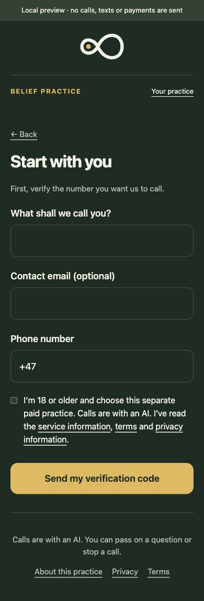

# Verification record — 10 October 2026

This is a locally implemented, tested product draft. It has not been deployed or validated with real callers. Live purchases and calls are disabled by default.

| Check | Result |
| --- | --- |
| Complete suite with a disposable PostgreSQL cluster | **620 passed, 0 failed, 0 skipped** |
| TypeScript | Passed |
| ESLint | Passed |
| Patch whitespace | Passed |
| Local preview API journey | Verified signup, verification, scheduling, simulated purchase, outcome/backlog, two caller-authored decisions, understanding, daily reflection, two weekly periods, retirement, preparation, pause/resume and CSRF rejection |
| Voice onboarding reconciliation | Verified discovered belief IDs survive signed transcript confirmation; aggregate and daily/weekly start save atomically |
| Private memory | Verified caller transcript matching, idempotent saves, altered retry rejection, closed-session minimisation and base-memory isolation |
| Scheduling | Verified concurrent claim exclusion, missed-slot handling, STOP/hold/payment/pause, Oslo DST and human coverage windows |
| Account privacy | Verified scoped credential expiry, product-specific OTP, optional email, complete private export, exclusion from older weekly exports and cascading erasure |
| Billing | Fake provider responses verify one-time price equality, renewal/refund rejection, purchase isolation and duplicate confirmation notices |
| Browser | Walked signup through onboarding/account; checked final desktop landing and 390-pixel phone layout/signup, with no horizontal overflow |
| Readiness diagnostic | Correctly reports live calls OFF and missing gate names, without printing values |
| Main checkout | Unmodified; implementation lives in a separate clone/branch |

Preview: `http://127.0.0.1:8770/beliefs`. Code `000000` and payment/weekly controls are explicitly local simulations. Restarting clears preview data; the application never places a call or sends a message from this server.

Screenshots of the final design:

The suite uses synthetic data and fake provider responses. It does not establish actual phone pacing, silence preservation, AMD, provider-console tool substitution, payment/refund delivery, staffed human response or effectiveness. The release sequence and required real-system checks are in [launch.md](launch.md). The scripts are original reviewed drafts; research boundaries are recorded in [research.md](research.md).

Two additive migrations are included and were exercised in the disposable database. Apply them before updated control/tick code, with launch flags disabled. No production database, provider settings, `.env` file, call, message or charge was changed during this work.
