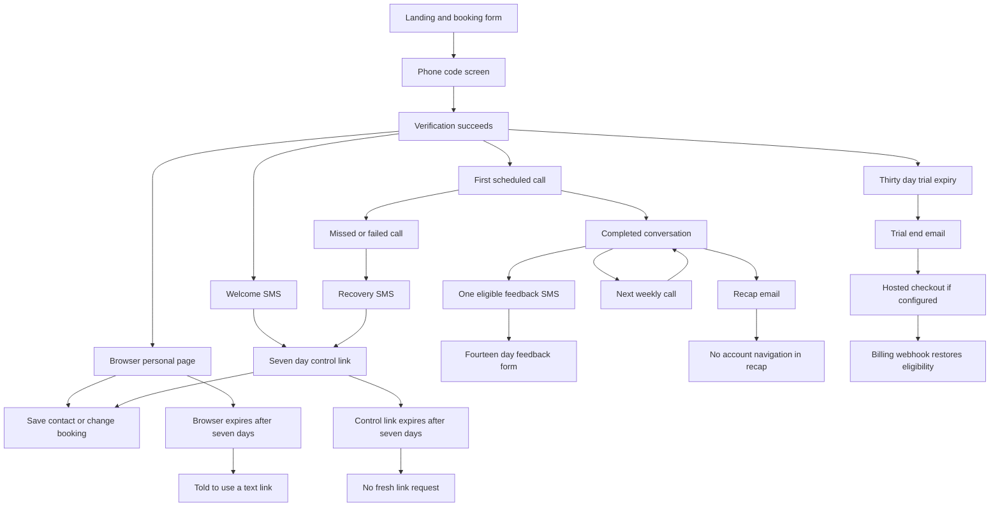

# 8&80 first month journey and improvement workshop

This brief maps the first 30 days of 8&80 for an improvement workshop: discovery, booking, phone verification, the first conversation, weekly calls, every application sendout, recovery, account controls, and the transition to payment.

**Main conclusion:** the product has a coherent voice and a strong weekly ritual. Its largest weaknesses are the handoffs between channels and the mismatch between what controls promise and what the system does. Make those handoffs reliable before adding more messages or polishing the visual identity.

Prepared 2 October 2026. Repository: [Sveisan/8-80](https://github.com/Sveisan/8-80). Reviewed the default branch `claude/8-80-prompt-v3-f9tk4m`, commit `2d6b561d76d7` dated 1 October 2026. The local source is in the 8and80 workspace under `source`. No product code was changed during that initial audit. Subsequent changes are recorded in [the improvement plan](first-month-improvement-plan.md).

[Complete sendouts and navigation inventory](first-month-sendouts-baseline.md)

## Evidence and limits

**Confirmed** means visible in the reviewed code, templates, or locally rendered screens. **Reproduced** means exercised locally with synthetic data and no external messages. **Hypothesis** means a proposed user response or improvement that needs research.

This is a source and local interface audit, not an audit of production traffic. The default branch is not proof of the deployed revision. Production environment variables, Speechify console prompts and tools, actual caller ID, delivery logs, checkout prices, payment-provider emails, and real user conversion rates were not inspected. No real signup, call, SMS, email, payment, or deletion was performed.

The existing focused journey tests reported **82 passed, 0 failed, 46 skipped** out of 128. The skipped tests require Postgres, which was unavailable locally. Additional synthetic checks reproduced skip, later, subscription-cancellation parsing, a late-night booking default, the settlement of a rescheduled first call, and a trial-end email with no checkout URL. Database effects described below are traced in the SQL implementation, not claimed as database integration tests.

Local signup, booking-confirmation and returning-control HTML were rendered from repository functions. Desktop and 390-pixel phone views were inspected. These fixtures verify rendering; they have no operational backend. Both analysis Pages were saved and their content read back. The Page viewer required a separate browser sign-in, so final Page rendering was not visually verified.

The current application path in the code is a Node control service, Postgres, Speechify calls, Twilio SMS and Resend email. Payment handling supports Stripe and Lemon Squeezy. README and ARCHITECTURE describe an older Next.js, Better Auth and Grok plan, so they are not reliable descriptions of the current journey. [Runtime dependencies](https://github.com/Sveisan/8-80/blob/2d6b561d76d7d749fc2eb5be3317ec69377a97c2/services/voice/src/control.ts#L529) · [Provider configuration](https://github.com/Sveisan/8-80/blob/2d6b561d76d7d749fc2eb5be3317ec69377a97c2/services/voice/src/config.ts#L133)

## The user value to preserve

8&80 offers a scheduled conversation that remembers what the caller said and returns to it next week. The first call connects what they enjoyed at eight, what they want by eighty, and what they want to move this year. They leave with one action in their own words. The recurring call asks what actually happened.

There are two useful activation milestones for the workshop:

1. **Initial value, proposed:** the caller confirms that the mentor understood them and leaves the first meaningful conversation with one action they chose.

2. **Experienced continuity, proposed:** a subsequent call accurately recalls that action, hears the result, and agrees a next step.

A completed signup or a provider status of “completed” is insufficient for either milestone. The code can mark a rescheduling conversation, a conversation with no commitment, or a long call with no caller transcript as completed. [Outcome classification](https://github.com/Sveisan/8-80/blob/2d6b561d76d7d749fc2eb5be3317ec69377a97c2/services/voice/src/call/outcome.ts#L76)

Keep the foundations that already support the proposition: no password or app installation, no card required for the trial, phone verification before scheduling, a contact card before the first call, one clear commitment per recap, restrained recovery texts, no repeated ringing after a known unanswered call, and a visible stop control. These are implemented strengths, subject to correct production configuration. [Signup](https://github.com/Sveisan/8-80/blob/2d6b561d76d7d749fc2eb5be3317ec69377a97c2/services/voice/src/signup/routes.ts#L118) · [Call retry boundary](https://github.com/Sveisan/8-80/blob/2d6b561d76d7d749fc2eb5be3317ec69377a97c2/services/voice/src/loop/tick.ts#L45) · [Contact and controls](https://github.com/Sveisan/8-80/blob/2d6b561d76d7d749fc2eb5be3317ec69377a97c2/services/voice/src/link/page.ts#L113)

## First month journey

Day 0 means the moment phone verification succeeds. The trial starts then and lasts **30 times 24 hours**, even if the first call is days away or missed. Public signup hardcodes 30 days; the separate TRIAL_DAYS configuration does not control that route. [Trial start](https://github.com/Sveisan/8-80/blob/2d6b561d76d7d749fc2eb5be3317ec69377a97c2/services/voice/src/signup/routes.ts#L28) · [Verification and booking](https://github.com/Sveisan/8-80/blob/2d6b561d76d7d749fc2eb5be3317ec69377a97c2/services/voice/src/signup/routes.ts#L132)

| Stage | What the user experiences | What determines the next step |
| --- | --- | --- |
| Before signup | “Two mentors. Both of them you.” Name, number and email fields, day chips and a time strip. AI identity, service explanation and free-month terms sit in closed FAQ sections below the button. | “Book my first call” submits the form. |
| Day 0 verification | A six-digit SMS code, valid for ten minutes, entered on a second screen. Six digits auto-submit; there is also a button. | Successful verification creates or updates the caller, starts a trial if eligible, and sets the weekly slot. |
| Day 0 confirmation | Welcome SMS with the first-call weekday/time and a control link. Browser redirects to /me, displays the appointment and offers “Save me as a contact”. | The first call is the next future occurrence of the chosen weekday/time. Browser and control link expire after seven days. |
| Waiting for the first call | No routine reminder or preparation sequence was found. The confirmation page is the main preparation surface. | User waits, moves the booking, or stops. The trial clock continues. |
| First meaningful call | Availability check; AI and written-note disclosure; eight, eighty and this-year questions; read-back; one action; slot confirmation; close. The script frames this as about ten minutes. | First versus returning agent is selected using callNumber, not a separate onboarding-complete state. |
| Immediately after a completed call | Email with the one action, call duration and usual next slot. A completed call without an extracted commitment gets a “No one thing this week” email. | A slot-change request or missing email can also trigger one assistance SMS. |
| At least 15 minutes later | One optional feedback SMS after an eligible completed call, default threshold one. | Requires a call of at least three minutes, no early-ending note, no feedback row, and no pause; eligibility lasts six hours. |
| First call plus 7 days | “Hello again”, previous action recalled, outcome explored, eight/eighty reflection or an assumption test, one next action, recap email. | Recurrence is tied to the chosen local weekly slot. |
| First call plus 14 days | Same recurring loop with updated context. | No separate second-week onboarding campaign. |
| First call plus 21 days | Same loop. If three consecutive weekly commitments went undone, the prompt can ask whether the goal is wrong or something else is happening. | The pattern is behavioral, not a message automatically sent on calendar day 21. |
| First call plus 28 days | A fifth scheduled opportunity only if it falls before expiry. | A 30-day trial usually contains four or five weekly opportunities before misses and reschedules. |
| At 30-day expiry | Calls become ineligible. One email says the free month is over and links to hosted checkout if configured. | Payment webhooks restore billing eligibility; payment does not undo a user pause. No application payment-success sendout was found. |

The timing is relative to the first appointment, not a universal Day 1, 7, 14, 21 sequence. For example, a first call six days after signup gives nominal calls on days 6, 13, 20 and 27. A first call soon after signup can give five. These examples assume the service is running and the weekly slot is unchanged.

With four or five successful calls, one successful OTP request, one welcome, one eligible feedback request and the trial-end email, the expected application contact volume through the expiry boundary is **3 SMS + 4–5 calls + 5–6 emails**. That is 12–14 touchpoints, not 12–14 messages. This is a calculated scenario, not observed delivery data. Recovery, user replies, exports and vendor billing messages add to it.

Sources: [Signup screen](https://github.com/Sveisan/8-80/blob/2d6b561d76d7d749fc2eb5be3317ec69377a97c2/services/voice/src/signup/page.ts#L103) · [First-call prompt](https://github.com/Sveisan/8-80/blob/2d6b561d76d7d749fc2eb5be3317ec69377a97c2/services/voice/src/prompt.ts#L85) · [Recurring prompt](https://github.com/Sveisan/8-80/blob/2d6b561d76d7d749fc2eb5be3317ec69377a97c2/services/voice/src/prompt.ts#L99) · [Feedback timing](https://github.com/Sveisan/8-80/blob/2d6b561d76d7d749fc2eb5be3317ec69377a97c2/services/voice/src/feedback/feedback.ts#L9) · [Trial expiry](https://github.com/Sveisan/8-80/blob/2d6b561d76d7d749fc2eb5be3317ec69377a97c2/services/voice/src/billing/trials.ts#L18)

## Navigation across channels

The ordinary happy path has a navigation gap: after the welcome link and browser access expire, a person who answers every call and has an email address gets no routine fresh control link. Recaps contain no control link. The feedback link has a different purpose and cannot open the controls. They can ask during a call, miss a call to get recovery, try an SMS reply where supported, re-enter signup, or seek support, but there is no dedicated self-service “send me a new access link” route. [Link purposes and expiry](https://github.com/Sveisan/8-80/blob/2d6b561d76d7d749fc2eb5be3317ec69377a97c2/services/voice/src/link/token.ts#L25) · [No link in recap](https://github.com/Sveisan/8-80/blob/2d6b561d76d7d749fc2eb5be3317ec69377a97c2/services/voice/src/recap/compose.ts#L126) · [Expired browser handling](https://github.com/Sveisan/8-80/blob/2d6b561d76d7d749fc2eb5be3317ec69377a97c2/services/voice/src/control.ts#L351)

The control page is primarily a rescheduling page rather than an account home. After the first call it leads with “Try again later today”, even when opened independently of a missed call. It shows the usual slot rather than the actual upcoming appointment, and its normal GET does not branch on paused or expired billing state. A stop confirmation renders a resume button, but reopening the URL returns the regular controls. [Personal page state](https://github.com/Sveisan/8-80/blob/2d6b561d76d7d749fc2eb5be3317ec69377a97c2/services/voice/src/control.ts#L386) · [Returning page](https://github.com/Sveisan/8-80/blob/2d6b561d76d7d749fc2eb5be3317ec69377a97c2/services/voice/src/link/page.ts#L100)

## Findings to resolve before visual refinement

The priority below is a workshop recommendation based on consequence and evidence, not measured frequency. “Critical” means a promise about control, billing or service continuity can be broken.

| Priority and finding | Evidence and concrete consequence | Proposed acceptance criterion |
| --- | --- | --- |
| Critical — access expires during normal use | Confirmed: browser and control links last seven days, recaps have no link, and expired pages offer no renewal. A satisfied user can lose self-service access in week two. | A user on day 15 can reach controls from any device using their phone number, without repeating onboarding or waiting for a call. |
| Critical — skip can claim success without skipping | Reproduced: handleReply returns “Consider it skipped” with no scheduler mutation. This fits a missed call whose slot already advanced, but does not cancel an upcoming or already-rescheduled call. The page exposes skip after the first call. | Skip removes exactly the named upcoming occurrence, preserves the weekly arrangement, and confirms the actual next date. |
| Critical — an interrupted first call can consume onboarding | Reproduced: a 25-second rescheduling conversation returns completed, invokes record and sends a recap. Code tracing shows record increments callNumber; the next call is then routed as returning. The recap promises the usual slot while the callback is scheduled separately. | An availability-only conversation preserves onboarding state, produces an appointment confirmation, and sends the full first-call experience at the agreed time. |
| Critical — leaving does not resolve billing | Reproduced: “cancel my subscription” is parsed as stop and only pauses calls. The page has no subscription cancellation route. Local deletion removes the caller and billing IDs without invoking the provider. A provider subscription may continue. | Pause, cancel renewal and delete are distinct, explicit actions; their billing consequences are stated and verified against the provider. |
| High — “later today” can become tomorrow morning | Reproduced: at 17:00 Oslo, later schedules 01:00 next day while saying “this evening”. It always adds eight hours. | Offer a named future time within an agreed calling window, with date and timezone in the confirmation. |
| High — service failures can become silence | Confirmed: failed recap and trial notices are logged without retry. Trial state changes before the notice is sent. Stale attempts are closed without a customer recovery text. Silent calls do not enter the missed-call text branch. | Every failed promise reaches a visible recovery state; retries use an outbox and deduplication so users receive one successful notice. |
| High — end of month is an abrupt stop | Confirmed: one email at expiry, no prior continuation surface in /me, no price in signup or trial email, and no application payment-success confirmation. If checkout is unset, the email still refers to a link that is absent. | A user can see trial end, price and continuation choice before service interruption, then see payment and next-call confirmation. |
| Medium — the first appointment can be almost a week away by default | Reproduced: Friday 2 October at 22:00 Oslo defaults to Friday 08:00, resolved to 9 October at 08:00, a 154-hour wait. Trial starts immediately. | Initial appointment selection always shows its calendar date and offers the nearest suitable future slot. |
| Medium — the selected time can be invisible on desktop | Reproduced in rendered signup and booking screens: 08:00 is checked while the time strip shows roughly 09:00–10:00. The scroll calculation uses offsetLeft outside the row coordinate space. It remained visible in the checked phone-width view. | The checked time stays visible at supported widths, on load and after selection, with keyboard navigation verified. |

Evidence: [Skip and later](https://github.com/Sveisan/8-80/blob/2d6b561d76d7d749fc2eb5be3317ec69377a97c2/services/voice/src/sms/missed.ts#L192) · [Rescheduled outcome](https://github.com/Sveisan/8-80/blob/2d6b561d76d7d749fc2eb5be3317ec69377a97c2/services/voice/src/call/outcome.ts#L102) · [Settlement and recap](https://github.com/Sveisan/8-80/blob/2d6b561d76d7d749fc2eb5be3317ec69377a97c2/services/voice/src/loop/settle.ts#L83) · [Call counter](https://github.com/Sveisan/8-80/blob/2d6b561d76d7d749fc2eb5be3317ec69377a97c2/services/voice/src/store/postgres.ts#L108) · [Cancellation parsing](https://github.com/Sveisan/8-80/blob/2d6b561d76d7d749fc2eb5be3317ec69377a97c2/services/voice/src/sms/reply.ts#L30) · [Local deletion](https://github.com/Sveisan/8-80/blob/2d6b561d76d7d749fc2eb5be3317ec69377a97c2/services/voice/src/store/postgres.ts#L342) · [Failure sweep](https://github.com/Sveisan/8-80/blob/2d6b561d76d7d749fc2eb5be3317ec69377a97c2/services/voice/src/loop/sweep.ts#L16) · [Late booking defaults](https://github.com/Sveisan/8-80/blob/2d6b561d76d7d749fc2eb5be3317ec69377a97c2/services/voice/src/signup/page.ts#L44) · [Time-strip scrolling](https://github.com/Sveisan/8-80/blob/2d6b561d76d7d749fc2eb5be3317ec69377a97c2/services/voice/src/signup/page.ts#L210)

## Other friction and consistency findings

**The service is explained after the commitment to book.** The initial screen is visually calm, but the headline does not identify a weekly AI phone call. AI identity, duration, what happens after a call and the free trial are in collapsed FAQs below the button. Hypothesis: cold visitors may book without a clear expectation or leave because they cannot tell what is offered. Test one plain explanatory sentence above the form while retaining the existing headline.

**The name is required but excluded from the call context.** The signup asks “What should I call you?” while the current call variables intentionally omit the name. That is a weak value exchange. Consider making it optional or removing it unless a concrete use is chosen. [Required fields](https://github.com/Sveisan/8-80/blob/2d6b561d76d7d749fc2eb5be3317ec69377a97c2/services/voice/src/signup/form.ts#L60) · [Name omitted](https://github.com/Sveisan/8-80/blob/2d6b561d76d7d749fc2eb5be3317ec69377a97c2/services/voice/src/loop/tick.ts#L179)

**Verification recovery restarts the booking.** Wrong codes have useful errors, but resend/change-number controls are replaced by “Start again”, which returns to a blank landing form. Requests exceeding rate limits still display “just sent” although no code was sent. This is an explicit abuse-control tradeoff that needs a more helpful user recovery design. [Rate limit behavior](https://github.com/Sveisan/8-80/blob/2d6b561d76d7d749fc2eb5be3317ec69377a97c2/services/voice/src/signup/routes.ts#L90) · [Code screen](https://github.com/Sveisan/8-80/blob/2d6b561d76d7d749fc2eb5be3317ec69377a97c2/services/voice/src/signup/page.ts#L225)

**The control page looks less certain than the system is.** Its email field is blank on normal GET even when signup stored an email. After the first call the page offers an add-to-goals box but never shows the existing goals or commitment. The privacy motivation is clear, but users cannot check what will be remembered or correct a mistaken recap there. Propose masked delivery-address confirmation and a stronger-authentication route for viewing or correcting personal context. [GET rendering](https://github.com/Sveisan/8-80/blob/2d6b561d76d7d749fc2eb5be3317ec69377a97c2/services/voice/src/control.ts#L409) · [Append-only goals](https://github.com/Sveisan/8-80/blob/2d6b561d76d7d749fc2eb5be3317ec69377a97c2/services/voice/src/store/postgres.ts#L357)

**Several copy promises outlive their mechanics.** “Say ALWAYS” alone is unparsed; the parser needs a day and time too. “The same link ... whenever you like” conflicts with seven-day control-link expiry. “Every text ... has a link” excludes the OTP and reply acknowledgements; feedback opens a different page. These are confirmed consistency issues, not tone preferences. [Reply parser](https://github.com/Sveisan/8-80/blob/2d6b561d76d7d749fc2eb5be3317ec69377a97c2/services/voice/src/sms/reply.ts#L91) · [Stop copy](https://github.com/Sveisan/8-80/blob/2d6b561d76d7d749fc2eb5be3317ec69377a97c2/SCRIPT.md#L1250) · [Signup copy](https://github.com/Sveisan/8-80/blob/2d6b561d76d7d749fc2eb5be3317ec69377a97c2/SCRIPT.md#L1354)

**Caller identity must be checked on a device.** Confirmation says the call comes from the number that texted. The contact card prefers SMS_FROM_NUMBER while Speechify uses a separate caller-ID configuration. Matching numbers are possible but not enforced by the page. Current script notes also say texts cannot be replied to, while other copy instructs STOP and START. Verify the actual sender type, inbound route, displayed number and saved-contact match. [Contact number selection](https://github.com/Sveisan/8-80/blob/2d6b561d76d7d749fc2eb5be3317ec69377a97c2/services/voice/src/link/vcard.ts#L28) · [Speechify caller ID](https://github.com/Sveisan/8-80/blob/2d6b561d76d7d749fc2eb5be3317ec69377a97c2/services/voice/src/config.ts#L311) · [Non-replyable sender note](https://github.com/Sveisan/8-80/blob/2d6b561d76d7d749fc2eb5be3317ec69377a97c2/SCRIPT.md#L1819)

**Public wording and operational assumptions need one review.** FAQ copy says information is not passed on, while the privacy policy describes service providers. The prompt assumes privacy terms were agreed at signup; the form has footer links but no visible acceptance statement. Terms say subscription cancellation is on the same page, but the page does not implement it. These are trust and consistency findings; this brief does not make a legal-compliance determination. [FAQ disclosure](https://github.com/Sveisan/8-80/blob/2d6b561d76d7d749fc2eb5be3317ec69377a97c2/SCRIPT.md#L1328) · [Privacy providers](https://github.com/Sveisan/8-80/blob/2d6b561d76d7d749fc2eb5be3317ec69377a97c2/legal/privacy.md#L85) · [Terms stopping](https://github.com/Sveisan/8-80/blob/2d6b561d76d7d749fc2eb5be3317ec69377a97c2/legal/terms.md#L48)

**No reliable activation baseline is available from this review.** Operational call statuses, feedback counts and follow-through counters exist, but signup funnel steps and semantic activation are not one measured journey. A provider-completed call must not be counted as a successful onboarding call without further evidence.

## A proposed first month to discuss

This is a workshop hypothesis, not an implementation specification or a promised conversion lift.

| Moment | Proposed experience | Keep the contact load restrained |
| --- | --- | --- |
| Discovery | Existing headline plus a plain service sentence: a weekly AI call, one action, a short recap. Show the free-month terms and eventual price clearly. | No new sendout. |
| Book | Separate the first appointment from the standing weekly slot when they differ. Show a real date, timezone and expected duration. | Retain phone verification. Preserve form values when resending or correcting the number. |
| Confirm | One clear booked state with date, caller number, contact card, optional calendar action and a durable way back. | Reuse the welcome SMS; do not add a welcome email merely to repeat it. |
| First conversation | Keep the current disclosure, personal frame and read-back. Track meaningful onboarding completion separately from call attempts. | An interrupted call gets a precise appointment confirmation. |
| After the call | Deliver the agreed action and the actual next appointment. Provide one discreet route to controls and correction. | Reuse the recap email. |
| Between calls | Default to quiet. Give users control over an optional reminder; test its value before making it routine. | Behavior and preference determine messages. Avoid a generic drip campaign. |
| Miss or technical failure | Acknowledge what actually happened and offer valid times. Skip and pause work immediately. | One successful recovery notice per event. |
| Second and third conversations | Prove memory accuracy, ask what happened without shame, and adjust the next action. | No additional campaign unless a demonstrated problem requires it. |
| Final trial conversation or page visit | Make the end date and continuation choice visible. Explore whether a short account of what changed helps the user assess value. | Test a continuation section in an existing recap before adding another email. |
| Continue or leave | Show price and billing period, confirm the payment outcome and next call, or clearly confirm stop/cancel/delete consequences. | Respect a decision to leave; make returning straightforward. |

A suggested product rule for every handoff: **the user can tell what happens next, when it happens, and how to change it.** Its practical test is whether someone can pause, recover, correct a misunderstanding or leave without discovering another channel by accident.

## Workshop plan

Proposed duration: **two hours**. Bring someone responsible for the product, design, engineering and customer conversations. These are suggested roles, not assigned owners.

| Minutes | Activity | Decision or output |
| --- | --- | --- |
| 0–15 | Walk through the current month, including a missed first call and a day-15 access attempt. | Shared understanding of the actual journey and evidence limits. |
| 15–30 | Agree who the first-month experience is for and what value it must deliver. | One initial-value definition and one continuity definition. |
| 30–55 | Resolve access, skip, interrupted onboarding, late callbacks and billing exits. | State rules and acceptance criteria for the critical defects. |
| 55–80 | Sketch booking, confirmation, returning account and recovery screens. | One primary action per state, actual next appointment, clear exit. |
| 80–100 | Walk through every sendout and its destination. | A contact policy specifying trigger, recipient state, destination, suppression and failure recovery. |
| 100–115 | Choose a small set of experiments and measurements. | Ranked backlog with an owner, evidence needed and success measure per item. |
| 115–120 | Read the proposed month aloud across all channels. | Inconsistencies captured and decisions recorded. |

Questions the workshop must settle:

1. Is the trial a fixed 30-day window or a guaranteed number of meaningful conversations? How do service failures affect it?

2. Is one chosen time both the first appointment and the recurring appointment? When should they differ?

3. What is the durable, low-friction way back into controls after seven days?

4. Which information can a lightweight control link show, and which requires renewed phone verification?

5. What exactly do skip, pause, cancel renewal, stop all contact and delete mean across every channel?

6. Should a reminder be opt-in, contextual, or absent? What evidence would change that decision?

7. Where does the user learn the post-trial price and see that payment succeeded?

8. How can a caller correct remembered information without waiting for the next conversation?

9. Which voice and language choices are real product choices? The public form currently exposes neither.

10. Who owns recovery when SMS, calls, recaps, feedback or payment webhooks fail?

## Measurement and validation

Use the first instrumented cohorts as the baseline. This review has no evidence for a current drop-off percentage or a predicted conversion lift.

| Measure | Suggested definition | Why it matters |
| --- | --- | --- |
| Verified booking conversion | Verified new callers divided by eligible landing visitors, with form and OTP steps reported separately. | Distinguishes unclear proposition from verification failure. |
| Time to initial value | Time from verification to first meaningful completed onboarding conversation; report median and upper tail. | A short form can still hide a week-long activation delay. |
| Appointment reliability | Calls started within an agreed tolerance divided by due eligible appointments; separate declined, missed and service failures. | Measures the central promise to turn up. |
| First-call pickup | Answered first opportunities divided by first opportunities that actually rang. | Tests caller recognition and preparation. |
| Memory and recap accuracy | Human-reviewed agreement between confirmed caller intent, stored context and recap, using consented samples. | Protects the experience at the next call. |
| Second meaningful call rate | Callers reaching a second meaningful conversation within their first two eligible weekly opportunities divided by eligible activated callers. | Measures continuity rather than raw call counts. |
| Recovery success | Missed or failed calls followed by a completed replacement within a defined window, divided by missed or failed calls. | Reveals whether recovery links solve the problem. |
| Control task success | Successful skip, move, pause, resume and cancellation tasks divided by attempts, including expired-link starts. | Makes control failures visible. |
| Delivery reliability | Successfully delivered transactional messages divided by intended sends, by type. Keep attempted, accepted and delivered separate. | A log saying “sent” is not evidence of receipt. |
| Continuation | Paid continuations divided by trials ending, segmented by meaningful calls experienced; report voluntary pause and cancellation separately. | Distinguishes product value from missing opportunities. |

Run short moderated sessions with first-time visitors before and after the proposed changes. Ask them to explain the service before opening the FAQs; book a call; recover from a wrong number; find their next call on day 15; skip an upcoming call; move one call without changing every week; recover from an interrupted first call; correct a recap; understand the trial price; and stop a paid subscription. Observe completion, wrong turns and expectation mismatches rather than asking only whether they like the design.

The immediate engineering acceptance scenarios are: expired access can be renewed; skip cancels the correct occurrence; “later” never silently becomes an overnight call; first-call rescheduling preserves onboarding; recap and schedule name the same appointment; paused and expired states render honestly; a stopped paid customer understands renewal status; deletion handles vendor billing deliberately; duplicate events send no duplicate notices; failed sends can recover without duplication.

Before treating this as the live customer journey, verify the deployed commit, active agent prompts, dynamic-variable delivery, voicemail behavior, number matching, SMS reply support, sender and email delivery configuration, checkout destination and price, provider receipts and dunning, payment return flow, cancellation portal and support response process.
