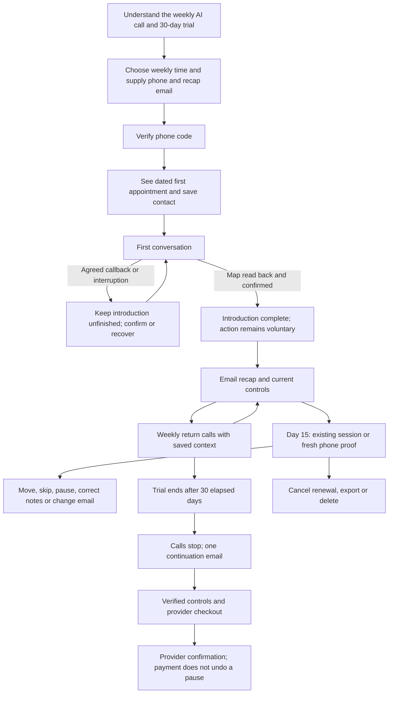

# First month: current journey and workshop kit

Prepared 3 October 2026 for `codex/first-month-journey`. This describes the implementation proposed in the PR, not a verified production deployment. Read the [original audit](first-month-audit.md), [original message inventory](first-month-sendouts-baseline.md), [implementation record](first-month-improvement-plan.md) and [delivery runbook](message-delivery.md) alongside it.

## The month in one view

A “month” is 30 elapsed days from verified enrollment. The first appointment uses the selected weekly slot; the trial can therefore contain four or five scheduled occurrences, fewer if calls are missed or paused. Neither conversation count nor compensation for service failure is a new promise in this PR.

| Moment | What the person sees or hears | What follows and where it leads |
| --- | --- | --- |
| Day 0: discovery | Weekly AI phone conversation, roughly ten minutes initially, shorter later, email recap, 30 days without a card. | `/start`: phone, email, usual day and time. Price is reviewed before payment; an actual price still needs provider verification. |
| Phone proof | Code entry, saved booking summary, resend and correction. Known rejection is a failure; uncertain delivery says the code may still arrive. | Code lasts ten minutes and five guesses. A draft can preserve choices for an hour. Existing accounts recover access without resetting trial, pause or context. |
| Verified booking | Actual first date/time/zone, trial end, contact download and controls. A welcome delivery problem does not undo enrollment. | Welcome SMS links to `/r/{token}`. The ordinary browser session lasts seven days. |
| First conversation | Availability, AI disclosure, eight/eighty/year map, read-back and an optional chosen action. | Explicit onboarding progress preserves an unfinished introduction. A 25-second callback does not advance the conversation counter. |
| Immediately afterwards | Recap of the action or a no-action letter. The appointment is described as booked when the conversation occurred. | Email `/me` is durable and contains no bearer credential. A changed schedule suppresses an obsolete queued SMS confirmation. |
| Optional feedback | Default: after the first eligible substantial call; configured thresholds can differ. | At least 15 minutes after completion, within six hours, at least 30 minutes from other accepted SMS. One accepted request per retained account; pause, preference and safety flags suppress it. |
| Weeks 2–4 | The previous action is carried into the returning prompt. No routine between-call drip campaign. | A normal recap follows each completed conversation. A missed, failed or interrupted call has a recovery route, without an invented next-week promise. |
| Any return, including day 15 | `/me` shows current appointment and billing/pause state, or `/access` asks for phone proof. | Move one appointment; explicitly change the weekly slot; skip the displayed occurrence; pause/resume when eligible. Confirmations provide a route back. |
| Correct a remembered detail | Fresh phone proof opens `/memory` for 15 minutes. | Edit the map, goals, belief or action. Stale forms cannot overwrite newer notes. Finish closes the private session. |
| Trial boundary | Trial end is visible in controls and recaps. At expiry, calls stop and one email points back to controls. | No charge without opting into a paid plan. Missing billing configuration offers support instead of a broken checkout. |
| Payment and exit | Canonical provider state controls entitlement. Pause, renewal cancellation, optional feedback and deletion are distinct. | Cancel preserves paid access to its end. Delete pauses immediately and waits for confirmed non-renewal before erasing local records. Failed confirmation retains the identifiers needed to resolve it. |

## Every application message family

Template keys refer to [SCRIPT.md](../SCRIPT.md). Provider receipts, payment retries and marketing outside this repository must be inventoried in the provider consoles before release.

| Trigger | Channel / exact template family | Destination and restriction |
| --- | --- | --- |
| Booking code | SMS `sms.code` | Code entry at `/start/verify`; ten-minute expiry, superseded codes suppressed. |
| Access or private-note proof | SMS `access.sms` | `/access/verify`; no enrollment or schedule mutation. |
| Verified new enrollment | SMS `sms.welcome` | Dated appointment and seven-day `/r/` controls; does not repeat for an existing account. |
| Ring unanswered | SMS `sms.missed` | `/r/` recovery. One message identity per call attempt. |
| Placement failed / silent / stale call | SMS `sms.failed`, `sms.interrupted` | `/r/` or recoverable `/me`; no automated catch-up call outside the agreed arrangement. |
| Agreed callback | SMS `sms.callback`, `sms.callback.unavailable` | Confirm the accepted date or provide controls. Paused callers receive no queued call follow-up. |
| Slot or email action owed after a call | SMS `sms.slot.link`, `sms.email.ask` | One `/r/` link; slot request takes priority if both apply. |
| SMS move | `sms.moved`, `sms.moved.always`, `sms.move.inactive`, `sms.later` | Day + time changes one call; day + time + ALWAYS changes the weekly slot. “Later” asks for a time. |
| SMS skip | `sms.skipped`, `sms.skip.unchanged`, `sms.skip.inactive`, `sms.skipped.trial_end`, `sms.skipped.paid_end` | Actual next eligible appointment or explicit end boundary. A bare request targets this local calendar week. |
| Stop/start | `sms.stopped`, `sms.started`, `sms.start.inactive` | STOP pauses and records SMS opt-out; the application reply is suppressed when opted out, so the carrier's confirmation needs real-device verification. START clears that preference and only resumes eligible calls. |
| Explicit subscription intent | `sms.subscription.cancelled`, `.none`, `.failed`, `.needs_verification` | Provider-confirmed renewal state or controls/support. Bare CANCEL is still call-stop intent. |
| Unrecognized SMS | `sms.unparsed` | Explains supported commands; signed inbound MessageSid deduplicates replies and schedule mutations during retained history. |
| Optional survey | `sms.feedback.1`, `.4`, default `sms.feedback` | Purpose-specific `/f/` link, valid 14 days; completion and expiry now lead to `/me`. |
| Conversation recap | Email `email.subject` or `.none`, `email.body.*`, `email.trial.reminder`, `email.controls` | Stored recap address; durable `/me`. An address correction suppresses queued mail to the old address. |
| Trial expiry | Email `email.trial.*` | `/me` for current continuation options, or configured support. |
| Payment failure | Email `email.payment.*` | Existing customer payment portal via verified controls. Provider dunning remains external. |
| Activation, cancellation, ending | Email `email.billing.subject`, `.active`, `.cancelled`, `.ended`, `.paused` | Confirms billing transition; current appointment is in controls. No implicit unpause. |
| Requested data copy | Email `email.export.*` | Stored address only after phone-verified authority. Includes retained operational records; excludes access secrets and duplicate copies of previous export payloads. |

All automatic transactional families above use the outbox. A web control action confirms on screen rather than issuing an extra SMS. Operator rehearsal/CLI tools are separate from automatic customer sendouts. There is no new reminder, progress digest, advance-expiry campaign, calendar invite, automatic win-back or push channel.

## Navigation and recovery

| Surface | Primary onward path | Recovery / authority |
| --- | --- | --- |
| `/`, `/start` | Book → code → first appointment | Signed-in `/` returns to `/me`; signup also offers `/access`. |
| `/start/verify`, `/start/resend`, `/start/edit` | Verify, resend or change preserved booking | Wrong/expired/rate-limited delivery states retain choices when the draft remains valid. |
| `/me` | Current call and account controls | Seven-day browser authority; sensitive account actions require phone proof. |
| `/r/{token}` | Same controls, plus verified billing/export/delete | Seven-day control capability; expired links offer recovery. No private-note viewing. |
| `/access`, `/access/verify` | Fresh control access or requested private-note session | One-use code; unknown numbers are not enrolled or texted. |
| `/memory` | Review → save → finish | Fresh 15-minute private session, not an ordinary SMS control token. |
| `/f/{token}` | Optional answers → thanks → `/me` | Feedback-only token, 14 days; expired state also links to `/me`. |
| `/contact.vcf` | Save the service number | Release check: the presented caller number and reply-capable SMS number must match the configuration. |
| `/terms`, `/privacy` | Read policy | Draft wording requires appropriate review and actual provider configuration. |
| Provider checkout/portal | Review price, pay, update card or cancel | HTTPS provider-owned URL. Return to `/me?billing=return` does not by itself grant entitlement. |

## Workshop: 120 minutes

| Time | Exercise | Concrete output |
| --- | --- | --- |
| 0–15 | Read the baseline audit and the changed month above. Identify evidence versus hypotheses. | Agreed problem statement and intended initial audience. |
| 15–40 | Walk a new booking, interrupted introduction and successful return call. Ask what is promised at each handoff. | Activation and continuity definitions, including voluntary refusal of an action. |
| 40–65 | Walk missed first call, day-15 lost access, paused-but-paid and trial expiry. | Prioritized expectation mismatches; choice on separate first and recurring times. |
| 65–85 | Review all message families and account authority. | Decisions on quiet periods, feedback, memory access and language/voice support. |
| 85–105 | Walk hosted price, cancellation, export and deletion in provider test mode. | Confirmed commercial terms, failure remedies, operational owners and unresolved release gates. |
| 105–120 | Rank the remaining problems by user impact and evidence. | Owner, acceptance test and next review date for each decision. |

Decision log to fill during the workshop:

| Decision | Current implementation / working assumption | Owner / decision / date |
| --- | --- | --- |
| Audience and value | Weekly reflective accountability for adults; user response unvalidated | Unassigned / open |
| Activation | Map confirmed plus an action the caller chose; read-back is a measurable proxy | Unassigned / open |
| Continuity | Accurate recall and a useful next step; repeat read-back alone cannot prove it | Unassigned / open |
| Trial | 30 elapsed days, no card; no guaranteed conversation count | Unassigned / open |
| First appointment | Uses the recurring time; one-off moves remain available | Unassigned / open |
| Commercial terms | Neither provider nor price selected by this PR | Unassigned / open |
| Private notes | Fresh phone code, 15-minute access, stale-edit protection | Unassigned / open |
| Messaging | Quiet between calls; one optional survey after eligible conversation | Unassigned / open |
| Language and voice | Confirm what the deployed voice agents actually support | Unassigned / open |

## User validation protocol

Recruit first-time visitors and returning callers separately. Use synthetic accounts for usability tasks; obtain consent before observing real conversation content. Ask participants to think aloud without showing the intended route.

Tasks: explain the service and cost before booking; choose a time with the keyboard/on a phone; recover from an uncertain code delivery; explain the next appointment after a short callback; recover access on day 15; move once versus permanently; pause without assuming renewal stopped; cancel renewal; correct a wrong remembered goal; export and delete after a simulated provider failure.

For each task record completion without help, wrong turns, elapsed time, the person's prediction of what happens next and the actual outcome. Separately ask whether the conversation was useful and whether remembered context was accurate. Do not infer these from a delivery receipt or a transcript marker. Start with a small qualitative round, fix serious confusion, then repeat with new participants. No sessions or improvement percentages are claimed here.

## Measurement and verification

`npm run journey` is a read-only 30-day retained-data report. Daily counters contain no visitor identifiers, cookies, IPs or form values. Milestones contain only account hash, a fixed event name and time; they are deleted with the account and pruned after 60 days. Message diagnostics last 30 days. The report exposes no account hashes or personal content.

Observed: booking page requests/submissions; new-account phone verification; call-attempt states; onboarding confirmation marker; action read-back events and repeat events; accepted/delivered/failed recaps; control page loads/submissions and selected applied/not-applied actions; trial end and first active subscription state. The cohort report includes median verification-to-first-read-back time.

Limits: request counts are not unique visitors and cannot be used as an attributed conversion funnel. Control confirmations and credential refusals are not all task outcomes; use the usability protocol to measure task success. Deleted accounts are absent. Recent cohorts are immature. Existing users get no invented historical milestone. No numerical baseline exists until this runs against an approved deployment. Value, memory accuracy, activation and retention uplift still require user validation.

The PR includes a whole-month database simulation, fault injection, signed provider fixtures and regression tests. Phone and desktop browser checks use synthetic accounts and fake providers. Actual phone delivery, voice timing/quality, hosted checkout, active console prompts, legal review and participant research remain release gates.
