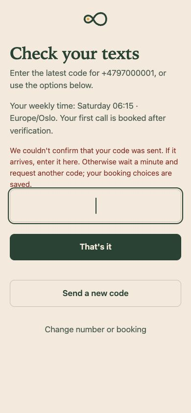
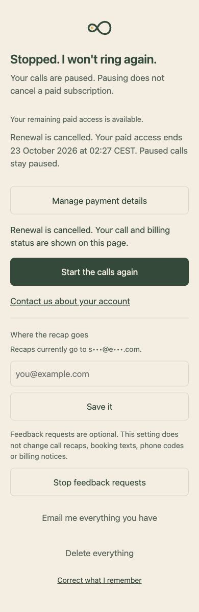
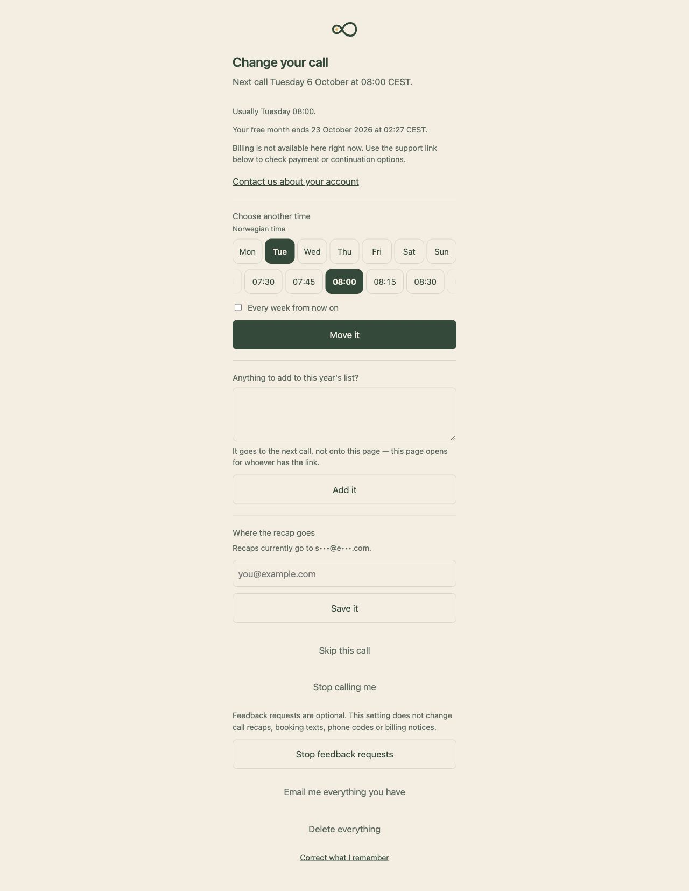

# First-month QA evidence

3 October 2026. Synthetic accounts, disposable PostgreSQL 18.4, fake voice/SMS/mail/payment providers. These images are local review evidence, not production or participant research. TypeScript, ESLint and all 564 tests passed with zero failures and zero skips. Final changes also pass `git diff --check`.

The database suite applies the actual migrations in a separate schema per test file. New fault-injection tests are in `message-outbox.test.ts`; provider response fixtures in `message-providers.test.ts`; the whole-month simulation in `first-month.test.ts`. Existing access, onboarding, billing, memory and scheduling suites cover their interrupted branches. The PR adds a PostgreSQL-backed CI check.

At 390px: keyboard time selection remained visible; an uncertain delivery page preserved the weekly time; a valid code completed enrollment; a failed welcome retained useful account controls. Paused paid account → cancellation confirmation → renewal cancelled preserved the call pause. At 1280px, the trial account retained a visible selected appointment and current trial boundary. Neither checked viewport overflowed horizontally. Screenshots were inspected for clipping and readable hierarchy.

Prior phase check logs and additional synthetic screenshots remain in the local workspace audit directory. Those historical counts (481, 507, 525 and 549) are superseded by the complete run above. Real-device, provider-console, price and participant validation are explicitly unverified.
